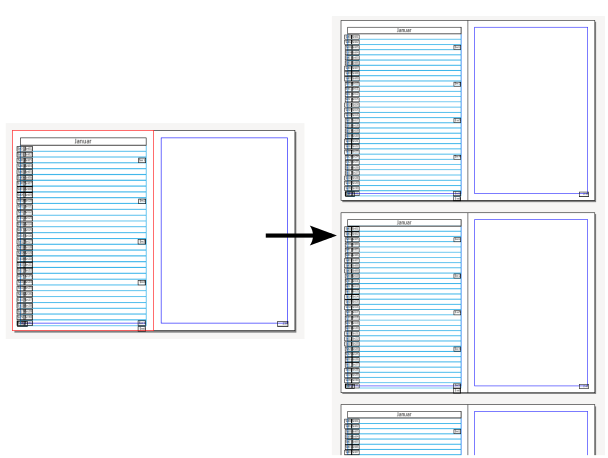
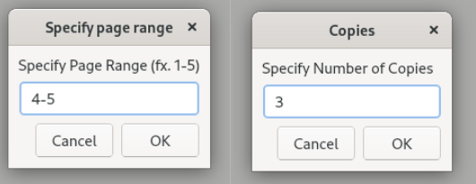

# Duplicate a range of pages plug-in for Scribus
By default Scribus only allows creating X copies of a single page. This is a small Python plug-in which allow specifying a page range to create X copies of. The plug-in appends the copies to the bottom of the document. 

## How to install

 1. Download a ZIP of this repository and unzip it.
 2. Open your document in Scribus. Go to _Script_ ➙ _Execute Script_ and choose the _DuplicatePageRange.py_ file.
 3. The plug-in asks whether its OK to save the document. Then you specify the page range and number of copies.

Licensed under GPL 3.0

